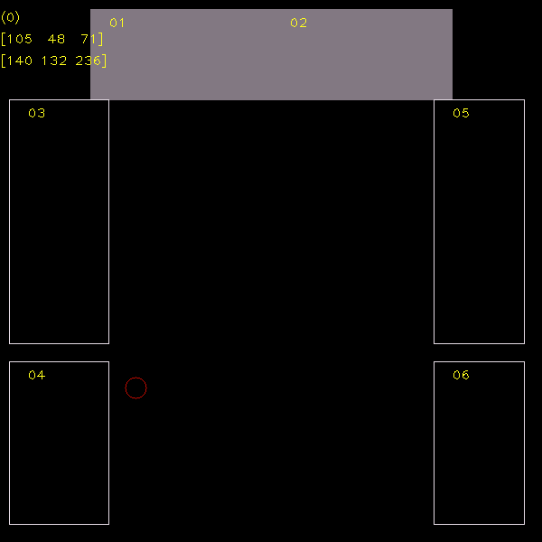

# AIVP_course_project

## Intro
Two hand segmentation approaches: Otsu's Binarization and Segmenting using inRange function of OpenCV. Requires simpleaudio (`pip3 install simpleaudio`) package to play wav samples.
The demos can be found here: https://drive.google.com/drive/folders/1t5CDP7kzOfIhs9Gh4BlqlVWPSSo_ZuKN?usp=sharing

## List of shortcuts
I used a series of shortcuts for better adjusting HSV windows.

In the example frame, the lower and upper HSV range are presented in top left. The number within the bracket denotes which channel is being controlled.
In the image it is (0) so it is the Hue channel being controlled, it can be adjust by the listed shortcuts:
* j: min_hue minus 1
* k: min_hue plus 1
* l: max_hue plus 1
* h: max_hue minus 1

By pressing left and right arrow key user can shift to next channel and the number in the top left should change. When the number in the top left corner becomes 1, the same shortcuts apply to Saturation channel, when it is 2 user controls the Intensity channel.
